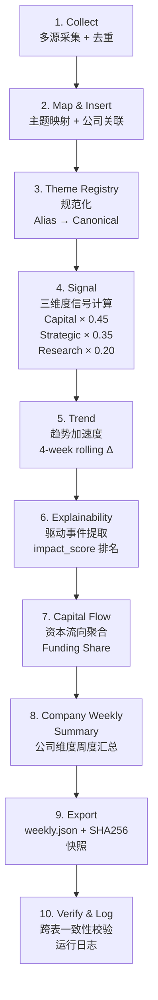

# Trend Tracker Architecture (v1.4)

> **Architecture Baseline** — 唯一架构参考文档，所有版本升级以本文档为准。
>
> **Last Updated:** 2026-06-02
> **Pipeline Version:** v1.4
> **Database Engine:** SQLite 3 (WAL mode)

---

## 1. System Overview

Trend Tracker 是一个 **AI 行业主题趋势追踪系统**，将非结构化新闻事件转化为可量化的主题信号、趋势加速度、资本流向和公司维度的结构化数据。

### 核心数据流

```
News Events → Theme Classification → Signal Scoring → Trend Acceleration → Capital Flow → Company Layer
```

### 最终产出

| 产出物 | 频率 | 格式 | 说明 |
|--------|------|------|------|
| **Daily Intelligence** | 每日 | 结构化事件表 | 当日采集、去重、主题分类后的原始信号事件 |
| **Weekly Snapshot** | 每周 | `weekly.json` | 全维度周报：主题评分 + 趋势加速度 + 资本流向 + 公司动态 + 可解释性 + SHA256 快照 |
| **Trend Research Dataset** | 持续积累 | SQLite DB | 所有历史数据的结构化存储，支持回溯查询和趋势回测 |

### 8 大追踪主题

| theme_id | theme_name | 覆盖范围 |
|----------|-----------|---------|
| `llm_frontier` | LLM 前沿模型 | 旗舰模型发布、架构创新、Scaling Laws、Benchmark 突破 |
| `ai_agent` | AI Agent 自主代理 | Agent 框架、工具使用、多步推理、浏览器 Agent |
| `inference_compute` | 推理计算 | 推理优化、量化、投机解码、边缘推理、推理芯片 |
| `ai_coding` | AI 编程 | 代码生成、IDE 集成、代码审查、自动修复 |
| `compute_gpu` | 算力与芯片 | GPU/TPU/NPU 供应、数据中心、互联、芯片设计 |
| `ai_video` | AI 视频生成 | 文生视频、视频编辑、扩散模型、实时视频理解 |
| `robotics` | 机器人 | 人形机器人、具身智能、操作、运动控制、Sim-to-Real |
| `ai_infrastructure` | AI 基础设施 | 向量数据库、MLOps、模型部署、RAG、Fine-tuning 平台 |

---

## 2. Pipeline Flow



**Stage 顺序不可变。** 每个 Stage 的输入依赖前一 Stage 的输出。

---

## 3. Current Pipeline Stages (v1.4)

### Stage 1: Collect（数据采集）

| 属性 | 值 |
|------|-----|
| **处理器** | `collectors/arxiv_collector.py`, `techcrunch_collector.py`, `github_collector.py` |
| **输入** | 外部 API / RSS（arXiv API, TechCrunch RSS, GitHub Trending API） |
| **输出** | 原始事件列表（去重后，以 URL 为去重键） |
| **数据源层级** | P0: arXiv（cs.AI/CL/LG/CV/RO）、P1: TechCrunch / GitHub Trending、P2: 预留（Reuters） |

步骤：并行采集 → 合并 → URL 去重 → 传入 Stage 2。

---

### Stage 2: Map & Insert（主题映射与入库）

| 属性 | 值 |
|-----|-----|
| **处理器** | `processors/theme_mapper.py`, `processors/company_mapper.py` |
| **输入** | Stage 1 去重后的事件列表 |
| **输出** | 写入 `events` 表 + `event_theme_mapping` 表 + `company_actions` 表 |

步骤：
1. `theme_mapper.py` — 关键词规则引擎（~120 条规则，8 主题）将每条事件分配 `primary_theme`
2. `company_mapper.py` — 三级匹配（别名 → DB 精确 → 模糊子串）将事件关联到公司，写入 `company_actions`
3. 批量 INSERT 到 `events`（含 noise_flag 过滤）和 `event_theme_mapping`

---

### Stage 3: Theme Registry Normalization（主题注册表归一化）

| 属性 | 值 |
|-----|-----|
| **处理器** | `processors/theme_registry_mapper.py` |
| **输入** | `events.primary_theme` 字段 |
| **输出** | 归一化后的 `canonical_theme`，写入 `theme_aliases` 匹配日志 |
| **版本** | v1.4 新增 |

步骤：
1. 从 `theme_registry` + `theme_aliases` 表加载注册表
2. 四级匹配：canonical 自映射 → alias 查表 → 大小写不敏感 → 透传（标记为 unmatched）
3. 记录匹配日志，追踪 "zero drift"（归一化前后一致率）

**8 个 Canonical Themes + 41 个别名（含 confidence score 0.70–0.95）。**

---

### Stage 4: Signal Calculation（三维度信号计算）

| 属性 | 值 |
|-----|-----|
| **输入** | 归一化后的 `event_theme_mapping` |
| **输出** | `signals` 表（每主题每周一行） |
| **评分模型** | v1.2 |

**信号公式：**

```
Signal = Capital × 0.45 + Strategic × 0.35 + Research × 0.20
```

| 子维度 | 权重 | 说明 |
|--------|------|------|
| Capital Score (0–10) | 45% | 融资/收购金额对数归一化 |
| Strategic Score (0–10) | 35% | 产品发布/合作/开源事件加权 |
| Research Score (0–10) | 20% | 研究论文/技术突破加权 |

附加字段：`signal_count`（当周事件数）、`data_quality`（HIGH / MEDIUM / LOW，基于事件数量和数据源层级）。

---

### Stage 5: Trend Calculation（趋势加速度）

| 属性 | 值 |
|-----|-----|
| **输入** | 当前周 + 前 3 周的 `signals.theme_score` |
| **输出** | `trends_weekly` 表 |
| **窗口** | 4-week rolling |

**趋势分类：**

| Trend Class | 条件 | 含义 |
|-------------|------|------|
| Accelerating | accel_4w > +20% | 加速上升 |
| Rising | +8% < accel_4w ≤ +20% | 温和上升 |
| Stable | -8% ≤ accel_4w ≤ +8% | 稳定 |
| Cooling | -20% ≤ accel_4w < -8% | 降温 |
| Declining | accel_4w < -20% | 快速下降 |

**验证分类（Validation Class）：** Strong Trend / Watchlist / Cooling / Speculation。

---

### Stage 6: Snapshot Explainability（快照可解释性）

| 属性 | 值 |
|-----|-----|
| **处理器** | `processors/explainability_processor.py` |
| **输入** | `signals` + `events`（当前周） |
| **输出** | `weekly.json` 中的 `snapshot_explainability` 区块 |
| **版本** | v1.3 新增 |

**impact_score 公式：**

```
impact_score = min(10, source_tier_score + event_type_score + amount_bonus)
```

| 参数 | 分值 |
|------|------|
| Source Tier | P0 = 8 / P1 = 5 / P2 = 2 |
| Event Type | FUNDING_ROUND / ACQUISITION = 3, PRODUCT_LAUNCH = 2.5, RESEARCH_PAPER = 3, PRODUCT_BETA = 2, PARTNERSHIP = 2, OPEN_SOURCE = 1.5, OTHER = 1 |
| Amount Bonus | min(5, log₁₀(amount_usd) − 6)，无金额则为 0 |

每主题提取 Top 3–5 个 driver events，包含 `title`、`source`、`impact_score`、`event_type`、`url`。

**零 Schema 变更，零评分模型变更。**

---

### Stage 7: Capital Flow（资本流向聚合）

| 属性 | 值 |
|-----|-----|
| **输入** | `events` 中含 `amount_usd` 的事件 |
| **输出** | `capital_flow` 表 |

步骤：按 `primary_theme` 聚合 funding_amount_usd → 计算 capital_share_pct（占总融资的比例）→ 判断 flow_direction（Inflow / Outflow / Stable，与上周对比 share 变化 > 5pp）。

---

### Stage 8: Company Weekly Summary（公司周度汇总）

| 属性 | 值 |
|-----|-----|
| **输入** | `company_actions`（当前周） |
| **输出** | `company_weekly_summary` 表 |
| **版本** | v1.2 新增 |

聚合维度：每公司当周 `action_count`、`funding_usd`（合计）、`launch_count`（PRODUCT_LAUNCH 次数）、`research_count`（RESEARCH_PAPER 次数）、`signal_score`（从 actions 类型加权推导）。

---

### Stage 9: Export（周报导出）

| 属性 | 值 |
|-----|-----|
| **输入** | 所有前序 Stage 的 DB 输出 |
| **输出** | `trend_data/weekly/{week_label}.json` + `weekly_snapshots` 表 |

步骤：从各表聚合当前周数据 → 组装 JSON → 写入文件 → 计算 SHA256 → 写入 `weekly_snapshots` 表（不可变快照）。

---

### Stage 10: Verify & Log（校验与日志）

| 属性 | 值 |
|-----|-----|
| **输入** | 所有 Stage 输出 |
| **输出** | `pipeline_runs` 表 + 控制台日志 |

校验项：
- 跨表一致性（events ↔ signals ↔ trends_weekly 行数校验）
- event_count 与 signal_count 一致性
- theme_id 引用完整性（外键约束自动校验）
- 写入 `pipeline_runs` 运行日志（状态、事件数、耗时、错误）

---

## 4. Database Schema

### 4.1 表概览（13 张表）

| # | 表名 | 版本 | 用途 |
|---|------|------|------|
| 1 | `themes` | v1.1 | 主题注册表（8 主题，含 parent_theme 演化支持） |
| 2 | `companies` | v1.1→v1.2 | 公司注册表（23 家公司，12 列，含描述/成立年份/总部/行业标签） |
| 3 | `events` | v1.1 | 原始事件记录（含 source_tier、noise_flag、company_name） |
| 4 | `event_theme_mapping` | v1.1 | M:N 事件到主题映射（含权重，支持多主题分配） |
| 5 | `signals` | v1.1 | 每主题每周信号评分（3 子维度 + 综合分） |
| 6 | `trends_weekly` | v1.1 | 趋势加速度（4-week rolling，含 trend_class + validation_class） |
| 7 | `capital_flow` | v1.1 | 资本流向（融资额 + 占比 + 方向） |
| 8 | `weekly_snapshots` | v1.1 | 不可变周报快照（JSON + SHA256） |
| 9 | `pipeline_runs` | v1.1 | Pipeline 运行日志（状态/事件数/错误） |
| 10 | `company_actions` | v1.2 | 公司动作记录（事件→公司关联，含 action_type 和金额） |
| 11 | `company_weekly_summary` | v1.2 | 公司周度汇总（物化视图，actions 聚合） |
| 12 | `theme_registry` | v1.4 | 主题治理注册表（canonical_theme + status + 时间戳） |
| 13 | `theme_aliases` | v1.4 | 主题别名映射（alias → canonical，含 confidence score） |

### 4.2 核心表字段

#### themes
| 字段 | 类型 | 说明 |
|------|------|------|
| theme_id | TEXT PK | 主题唯一标识，如 `ai_agent` |
| theme_name | TEXT | 中文名，如 "AI Agent 自主代理" |
| parent_theme | TEXT FK | 父主题（NULL = root），支持 split/merge |
| theme_version | INTEGER | 主题版本号 |
| is_active | INTEGER | 1 = 活跃，0 = 已归档 |

#### events
| 字段 | 类型 | 说明 |
|------|------|------|
| event_id | TEXT PK | 事件唯一 ID |
| source_tier | TEXT | P0 / P1 / P2 |
| source_name | TEXT | arXiv / TechCrunch / GitHub / Reuters |
| event_type | TEXT | FUNDING_ROUND / PRODUCT_LAUNCH / RESEARCH_PAPER / ... |
| primary_theme | TEXT FK | 主题分类 |
| title | TEXT | 事件标题 |
| amount_usd | REAL | 融资金额（NULL 表示无金额） |
| noise_flag | INTEGER | 0 = signal, 1 = noise |
| week_label | TEXT | ISO 周标签，如 `2026-W23` |
| company_name | TEXT | 关联公司名（原始文本） |

#### signals
| 字段 | 类型 | 说明 |
|------|------|------|
| theme_id | TEXT FK | 主题 |
| week_label | TEXT | 周标签 |
| capital_score | REAL (0–10) | 资本信号 |
| strategic_score | REAL (0–10) | 战略信号 |
| research_score | REAL (0–10) | 研究信号 |
| theme_score | REAL | 综合评分（加权平均） |
| signal_count | INTEGER | 当周事件数 |
| data_quality | TEXT | HIGH / MEDIUM / LOW |

#### trends_weekly
| 字段 | 类型 | 说明 |
|------|------|------|
| theme_id | TEXT FK | 主题 |
| week_label | TEXT | 周标签 |
| current_score | REAL | 本周 signal 评分 |
| prev_week_score | REAL | 上周评分（NULL = 首周） |
| accel_4w | REAL | 4 周滚动变化率（%） |
| trend_class | TEXT | Accelerating / Rising / Stable / Cooling / Declining |
| validation_class | TEXT | Strong Trend / Watchlist / Cooling / Speculation |

#### theme_registry（v1.4）
| 字段 | 类型 | 说明 |
|------|------|------|
| canonical_theme | TEXT UNIQUE | 规范主题 ID |
| description | TEXT | 治理描述 |
| status | TEXT | ACTIVE / DEPRECATED / MERGED |
| created_at / updated_at | TEXT | 时间戳 |

#### theme_aliases（v1.4）
| 字段 | 类型 | 说明 |
|------|------|------|
| alias_name | TEXT | 别名文本 |
| theme_id | TEXT FK | 映射到的 canonical_theme |
| confidence | REAL (0–1) | 映射置信度 |

#### company_actions（v1.2）
| 字段 | 类型 | 说明 |
|------|------|------|
| action_id | TEXT PK | 动作 ID |
| company_id | TEXT FK | 关联公司 |
| event_id | TEXT FK | 关联事件 |
| action_type | TEXT | FUNDING_ROUND / PRODUCT_LAUNCH / ... |
| amount_usd | REAL | 金额（可空） |
| theme_id | TEXT FK | 关联主题 |
| source_tier | TEXT | P0 / P1 / P2 |

#### company_weekly_summary（v1.2）
| 字段 | 类型 | 说明 |
|------|------|------|
| company_id | TEXT FK | 公司 |
| week_label | TEXT | 周标签 |
| action_count | INTEGER | 动作总数 |
| funding_usd | REAL | 融资总额 |
| launch_count | INTEGER | 产品发布数 |
| research_count | INTEGER | 研究论文数 |
| signal_score | REAL | 综合信号分 |

---

## 5. weekly.json Schema

### 5.1 顶层结构

```json
{
  "meta": { ... },
  "theme_scores": [ ... ],
  "trend_acceleration": [ ... ],
  "capital_allocation": [ ... ],
  "snapshot_explainability": [ ... ],
  "company_actions": [ ... ],
  "company_weekly_summary": [ ... ],
  "top_events": [ ... ],
  "data_warnings": [ ... ]
}
```

### 5.2 各区块字段说明

#### meta（元数据）

| 字段 | 说明 |
|------|------|
| week_label | ISO 周标签 |
| generated_at | 生成时间戳 |
| pipeline_version | Pipeline 版本（当前 v1.4） |
| scoring_version | 评分模型版本（当前 v1.2） |
| event_count | 当周事件总数 |
| data_source | real / mock |

#### theme_scores（主题评分排行）

| 字段 | 说明 |
|------|------|
| theme_id | 主题 ID |
| canonical_theme | 规范化主题 ID（v1.4 新增） |
| theme_name | 中文名 |
| theme_score | 综合评分 |
| capital_score | 资本信号（0–10） |
| strategic_score | 战略信号（0–10） |
| research_score | 研究信号（0–10） |
| signal_count | 当周事件数 |
| data_quality | HIGH / MEDIUM / LOW |

#### trend_acceleration（趋势加速度）

| 字段 | 说明 |
|------|------|
| theme_id | 主题 ID |
| canonical_theme | 规范化主题 ID（v1.4 新增） |
| theme_name | 中文名 |
| accel_4w_pct | 4 周滚动变化率（%） |
| trend_class | Accelerating / Rising / Stable / Cooling / Declining |
| validation_class | Strong Trend / Watchlist / Cooling / Speculation |

#### capital_allocation（资本分配）

| 字段 | 说明 |
|------|------|
| theme_id | 主题 ID |
| theme_name | 中文名 |
| funding_usd | 当周融资总额（USD） |
| share_pct | 占总融资比例（%） |
| deal_count | 交易笔数 |

#### snapshot_explainability（快照可解释性，v1.3 新增）

| 字段 | 说明 |
|------|------|
| theme | 主题 ID |
| theme_name | 中文名 |
| trend | 趋势分类 |
| current_score | 当前综合评分 |
| drivers | Top 3–5 驱动事件列表 |

每个 driver 含：`title`、`source`、`published_at`、`impact_score`（0–10）、`event_type`、`url`。

#### company_actions（公司动作，v1.2 新增）

| 字段 | 说明 |
|------|------|
| company_id | 公司 ID |
| company_name | 公司名称 |
| ticker | 股票代码（可空） |
| action_type | 动作类型 |
| action_date | 日期（YYYY-MM-DD） |
| theme_id | 关联主题 |
| amount_usd | 金额（可空） |
| description | 动作描述 |
| source_tier | P0 / P1 / P2 |

#### company_weekly_summary（公司周度汇总，v1.2 新增）

| 字段 | 说明 |
|------|------|
| company_id | 公司 ID |
| company_name | 公司名称 |
| ticker | 股票代码（可空） |
| primary_theme | 主要关联主题 |
| action_count | 当周动作数 |
| funding_usd | 当周融资总额 |
| launch_count | 产品发布数 |
| research_count | 研究论文数 |
| signal_score | 综合信号分 |

#### top_events（Top 事件列表）

排名前 15 的原始事件，含 `title`、`description`、`source`、`type`、`theme`、`url`、`company`。

#### data_warnings（数据质量警告）

字符串数组，标注数据质量问题（如 "Mock data"、"accel_4w based on 2 data points only"）。

---

## 6. Design Principles

| 原则 | 说明 |
|------|------|
| **Incremental Development** | 每次版本升级仅增量修改，不重构 Pipeline 整体结构。Stage 顺序和数目可增不可变。 |
| **Backward Compatibility** | 新版本必须兼容旧版本产出的 `weekly.json` 和 Schema。字段只增不删。所有迁移脚本可幂等执行。 |
| **No Silent Schema Drift** | 所有 Schema 变更通过 `db/migrations/` 目录中的编号 SQL 脚本来执行，禁止手动改表。Pipeline 版本号写入 `meta.pipeline_version`。 |
| **Theme Governance First** | 主题名称变更（别名、合并、拆分）必须在 Theme Registry 中注册，不允许在代码中硬编码等价关系。`canonical_theme` 是系统内部的唯一真理。 |
| **Explainability Before Complexity** | 任何评分或趋势输出必须可追溯到具体驱动事件。在增加新评分维度之前，先确保现有维度可解释。 |
| **Data Quality Transparency** | 输出标注 `data_quality`（HIGH/MEDIUM/LOW）和 `source_tier`（P0/P1/P2），绝不伪装确定性。Mock 数据明确标注。 |
| **Immutable Snapshots** | 每周导出后写入 `weekly_snapshots` 表（含 SHA256），评分模型升级不影响历史快照。 |

---

## 7. Version History

| 版本 | 日期 | 变更 | Commit |
|------|------|------|--------|
| **v1.1** | 2026-06-02 | **MVP** — Core Pipeline：三源采集 + 8 主题映射 + 三维度信号 + 趋势加速度 + 周报导出。9 张基础表。 | `7bde648` |
| **v1.2** | 2026-06-02 | **Company Layer** — 公司维度数据沉淀。companies 扩展至 12 列 + company_actions + company_weekly_summary。weekly.json 新增 2 区块。 | `d093619` |
| **v1.3** | 2026-06-02 | **Snapshot Explainability** — 每个主题趋势可追溯到 Top 3-5 驱动事件。impact_score 公式。零 Schema 变更。 | `d7e02ce` |
| **v1.4** | 2026-06-02 | **Theme Registry** — 建立 8 Canonical + 41 Alias 的主题治理层。theme_registry + theme_aliases 表。weekly.json 新增 canonical_theme 字段。 | _(working tree)_ |

### 演进路线

| 版本 | 表数 | Pipeline Stages | weekly.json 区块数 |
|------|------|-----------------|-------------------|
| v1.1 | 9 | 8 | 5 |
| v1.2 | 11 | 9 | 7 |
| v1.3 | 11 | 9 | 8 |
| v1.4 | 13 | 10 | 9（canonical_theme 字段） |

---

## 附录：项目文件清单

```
trend_tracker/
├── pipeline_real.py              # 真实数据 Pipeline（v1.4, 10 阶段, 763 行）
├── pipeline_mock.py              # Mock Pipeline（v1.4, 672 行）
├── README.md                     # 项目说明
├── ROADMAP.md                    # 版本路线图
├── docs/
│   └── ARCHITECTURE.md           # 本文档
├── collectors/
│   ├── arxiv_collector.py        # arXiv API 采集器（P0, cs.AI/CL/LG/CV/RO）
│   ├── techcrunch_collector.py   # TechCrunch RSS 采集器（P1）
│   ├── github_collector.py       # GitHub Trending API 采集器（P1）
│   └── reuters_collector.py      # Reuters 预留（未集成）
├── processors/
│   ├── theme_mapper.py           # 关键词规则引擎 → 主题分类（~120 规则）
│   ├── company_mapper.py         # 公司名称映射（~65 别名）
│   ├── explainability_processor.py  # 快照可解释性（impact_score）
│   └── theme_registry_mapper.py     # 主题注册表归一化（v1.4）
├── db/
│   ├── db_init_v1.1.sql          # v1.1 完整 Schema（9 表 + 种子数据）
│   ├── migrations/
│   │   ├── 001_company_layer.sql     # v1.2 迁移
│   │   └── 002_theme_registry.sql    # v1.4 迁移
│   └── trend_tracker.db          # SQLite 运行时数据库
├── trend_data/weekly/            # 周报导出目录
├── calculators/                  # 预留
├── export/                       # 预留
└── tests/                        # 预留
```
